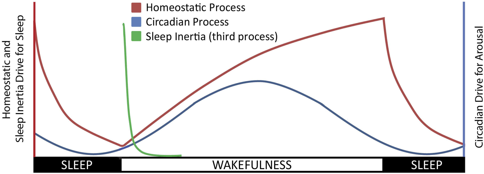

# Sleep Intertia

## **_What_** is?

Sleep intertia is defined as a transitional state after sudden awakeinf from sleep marked by a brief period of inferior task performance, disorientation, reduced vigilance and a desire to return to sleep. The intensity and duration vary based on situational factors, normally lasts less than 5 min and has no serious impact on conducting routine jobs but its effects may last minutes to several hours [1, 2]. In patients with hypersomnolence disorders a more pronounced period of confusion and sleepiness upon awakening, this also known as "sleep drunkenness".

## **_Who_** can experience it?

Individuals has suggested that waking up could be challenging for them. Around 42% of adolescents report having trouble getting up almost every morning [4], whereas this confusion experienced upon waking tends to decrease as they grow older [4, 5]. Both men and women report experiencing similar challenges when waking up [6] along with similar rates of confusion after awakening [4, 5].

Chronotype also influences how sleep inertia could affect, such that night owls report more sleep inertia on workdays but sleep inertia seems to be independent of chronotype on non-work days [7]. On the other hand, shift and night work has been reported that increase the risk of confusion on awakening [4].

## **_Why_** we can experience it?

Sleep and sleepiness are primarily regulated by two main processes: a homeostatic drive or pressure for sleep (Process S) and a circadian rhythm of arousal (Process C) [7a]. _Process S_ promotes sleepiness as hours of wakefulness accumulate and decreases with the time being asleep. Conversely, _Process C_ is driven by a circadian pacemaker, the suprachiasmatic nucleus, to promote sleep at night and mantain alertness during the day [7b]. Thus, these two-process model of sleep regulation would predict higher alertness and performance following reduction of the homeostatic drive, which often occur simultaneously with a rise in the circadian drive for alertness following habitual morning awakenings. However, at this time there is a short, yet salient, decrease in alertness and performance immediately after waking. In order to better describe these fluctuations in sleepines, a third-process (_Process W_; or _Process I_, in some descriptions) [7c] is added to the final model that could explain sleep regulation (Figure 1).

> Figure 1: Sleep model regultarion [7d]

From an evolutionary perspective, this third process of sleep regulation is counterintuitive, as the ability to rapidly awaken from sleep would be advantageous, for example when awakening in response to a potential threat. Therefore, different studies tried to understand why sleep inertia happens. A first possible explanation is that it results from the conflict between mantaining sleep and becoming behaviorally responsive, promoting sleep upon awakening so that sleep is maintained when the awakening is not desired [8, 8a]. Another explanation could be that sleep inertia may occur because the brain requires a gradual transition after rapid eye movement (REM) sleep to wakefulness in order to reduce the chances of hypnopompic intrusions in wakefulness and due to the complexity of neural circuitry in transitioning from one state to another [9]. 

It has also been hypothesized that sleep inertia may result from awakening before adenosine has been fully cleared [10]. Adenosine levels rise during sleep restriction and decrease gradually during subsequent sleep, particularly in the basal forebrain [11], this hypothesis could explain the stronger sleep inertia observed after recovery sleep compared to baseline sleep [12, 13]. Moreover, the reduction of subjective sleepiness after awakening aligns with cooling and cortisol awakening response, suggesting potential relationship of both thermoregulation and the hypothalamic-pituitary-adrenal axis to sleep inertia [14, 15]. 

Given that the underlying mechanisms of sleep inertia are still not fully understood and its exact function remains largely unknown, various studies emphasize the need for further research to clarify these theories as to the function of this sleep regulation process [16, 17].

## **_How_** can we detect it?

### Electroencephalography

Power spectral analyses of electroencephalography (EEG) after waking have suggested that, compared to pre-sleep wakefulness, post-sleep EEG typically contains higher delta power (associated with deep sleep) and lower beta power (associated with wakefulness) [17-20]. On the other hand, changes in theta power, typically associated to drowsiness or REM sleep, have been reported with less consistency [17,18,20]. Regional variations in power have also been found, including a greater increase in delta waves in the posterior regions, which may imply a slower reactivation of these areas after awakening [17-19].

Vallat et al [20] evaluated the functional connectivity of different brain regions post-awakening. They asserted that awakening from sleep is followed by disrupted cerebral and cognitive functioning that dissipate in the follow first half hour . They observed that, compared to waking from lighter N2 sleep, waking from deeper N3 sleep had higher connectivity between the default mode network and brain regions responsible for sensory-motor control and attention. The authors posited that this reduction of functional brain network segregation from the default mode network, which is also observed during sleep and periods of elevated sleepiness [21] may be responsible for the physical and cognitive effects observed during sleep inertia. In resume, they could demostrate that awakening from N3 (deep) sleep induced the most robust disruption.

### Evoked Potential

### Cerebral blood flow

### Magnetic resonance imaging

## **_When_** is it more probable to experience it? When not?

* Drinking caffeine just before a nap has been suggested as a useful countermeasure for sleepy drivers [53]. Both caffeine infusion during sleep deprivation (0.3 mg/kg/hr) and caffeine gum chewed for five minutes immediately after awakening (~85 mg caffeine) lessen sleep inertia following naps [12, 54]. 

* Simple exposure to light of varying intensities, either during or immediately after sleep, does not meaningfully impact sleep inertia as measured subjectively or objectively [55, 56]. In contrast, dawn simulators, which gradually increase the lux of light before awakening, have preliminary promise. Three studies have found improvements in subjective sleepiness on awakening, with modest objective performance benefits in one [57-59]. All three studies reported financial support from the simulator manufacturers.

* Pink noise at 75 decibels improves performance following a nap at midnight, but may have limited generalizability given that it also worsens performance following a rest at 0400 [60]. 

* Application of a cold wet cloth and fan breeze improves post-nap performance [61] and is consistent with the hypothesis that sleep inertia is modulated by changes in body temperature [17]. Further work is needed to clarify the role of these interventions in dissipating sleep inertia, especially in occupational settings.

## Bibliography

[1] Trotti, L. M. Waking up is the hardest thing I do all day: Sleep inertia and sleep drunkenness. Sleep medicine reviews 2017; 35: 76-84.

[2] Naitoh, P., Kelly, T., & Babkoff, H. Sleep inertia: best time not to wake up?. Chronobiology international 1993; 10(2): 109-118.

[3] Amaral O, Garrido A, Pereira C, Veiga N, Serpa C, Sakellarides C. Sleep patterns and insomnia among
portuguese adolescents: a cross-sectional study. Atencion primaria / Sociedad Espanola de Medicina de
Familia y Comunitaria 2014; 46 Suppl 5: 191-4.

[4] Ohayon MM, Priest RG, Zulley J, Smirne S. The place of confusional arousals in sleep and mental disorders: findings in a general population sample of 13,057 subjects. The Journal of nervous and mental
disease 2000; 188: 340-8.

[5] Ohayon MM, Mahowald MW, Leger D. Are confusional arousals pathological? Neurology 2014; 83: 834-41

[6] Adan A, Natale V. Gender differences in morningness-eveningness preference. Chronobiology international 2002; 19: 709-20.

[7] Roenneberg T, Wirz-Justice A, Merrow M. Life between clocks: daily temporal patterns of human chronotypes. Journal of biological rhythms 2003; 18: 80-90.

[7a] Achermann P. The two-process model of sleep regulation revisited. Aviat Space Environ Med. 2004;75(Supplement 1):A37–A43.

[7b] Turek F. Introduction: master circadian clock and master circadian rhythm. In: Kryger MH, Roth T, Dement WC, editors. Principles and Practice of Sleep Medicine. 5th ed. St Louis, MO: Elsevier Saunders; 2011:360–362.

[7c] Folkard S, Åkerstedt T. A three-process model of the regulation of alertness-sleepiness. In: Broughton RJ, Ogilvie RD, editors. Sleep, Arousal, and Performance. Boston: Birkhäuser 1992:11–26.

[7d] Hilditch, C. J., & McHill, A. W. Sleep inertia: current insights. Nature and science of sleep 2019; 155-165.

[8] Peter-Derex L, Magnin M, Bastuji H. Heterogeneity of arousals in human sleep: A stereoelectroencephalographic study. NeuroImage 2015; 123: 229-44.

[8a] Dijk D-J, Czeisler CA. Paradoxical timing of the circadian rhythmof sleep propensity serves to consolidate sleep and wakefulness in humans Neurosci Lett. 1994;166(1):63–68.

[9] Vyazovskiy VV, Cui N, Rodriguez AV, Funk C, Cirelli C, Tononi G. The dynamics of cortical neuronal activity in the first minutes after spontaneous awakening in rats and mice. Sleep 2014; 37: 1337-47.

[10] Van Dongen HP, Price NJ, Mullington JM, Szuba MP, Kapoor SC, Dinges DF. Caffeine eliminates psychomotor vigilance deficits from sleep inertia. Sleep 2001; 24: 813-9.

[11] Porkka-Heiskanen T, Kalinchuk AV. Adenosine, energy metabolism and sleep homeostasis. Sleep Med Rev 2011; 15: 123-35.

[12] Ferrara M, De Gennaro L, Casagrande M, Bertini M. Selective slow-wave sleep deprivation and timeof-night effects on cognitive performance upon awakening. Psychophysiology 2000; 37: 440-6.

[13] Ferrara M, De Gennaro MFL, Bertini M. Voluntary oculomotor performance upon awakening after total sleep deprivation. Sleep 2000; 23: 801-11.

[14] Krauchi K, Cajochen C, Wirz-Justice A. Waking up properly: is there a role of thermoregulation in sleep inertia? J Sleep Res 2004; 13: 121-7.

[15] Clow A, Hucklebridge F, Stalder T, Evans P, Thorn L. The cortisol awakening response: more than a measure of HPA axis function. Neuroscience and biobehavioral reviews 2010; 35: 97-103.

[16] Matchock RL. Circadian and sleep episode duration influences on cognitive performance following the process of awakening. International review of neurobiology 2010; 93: 129-51.

[17] Marzano C, Ferrara M, Moroni F, De Gennaro L. Electroencephalographic sleep inertia of the awakening brain. Neuroscience 2011; 176: 308-17.

[18] Ferrara M, Curcio G, Fratello F, et al. The electroencephalographic substratum of the awakening. Behav Brain Res. 2006;167(2):237–244.

[19] Gorgoni M, Ferrara M, D’Atri A, et al. EEG topography during sleep inertia upon awakening after a period of increased homeostatic sleep pressure. Sleep Med. 2015;16(7):883–890.

[20] Vallat R, Meunier D, Nicolas A, Ruby P. Hard to wake up? The cerebral correlates of sleep inertia assessed using combined behavioral, EEG and fMRI measures. NeuroImage. 2019;184:266–278.

[21] Picchioni D,Duyn JH,Horovitz SG. Sleep and the functional connectome. NeuroImage. 2013;80:387–396.